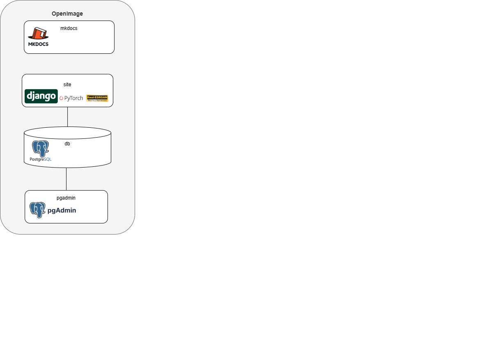

# OpenImage DEV Architecture

OpenImage is a containerized Python application, using Python 3.11 and postgres 14 ([More info here](about.md)).

It also has a Documentation (mkdocs) and a database admin Tool (PgAdmin).

