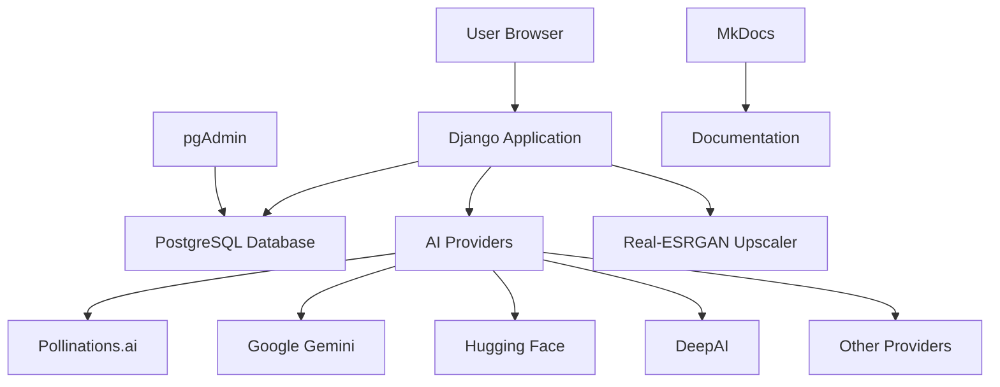
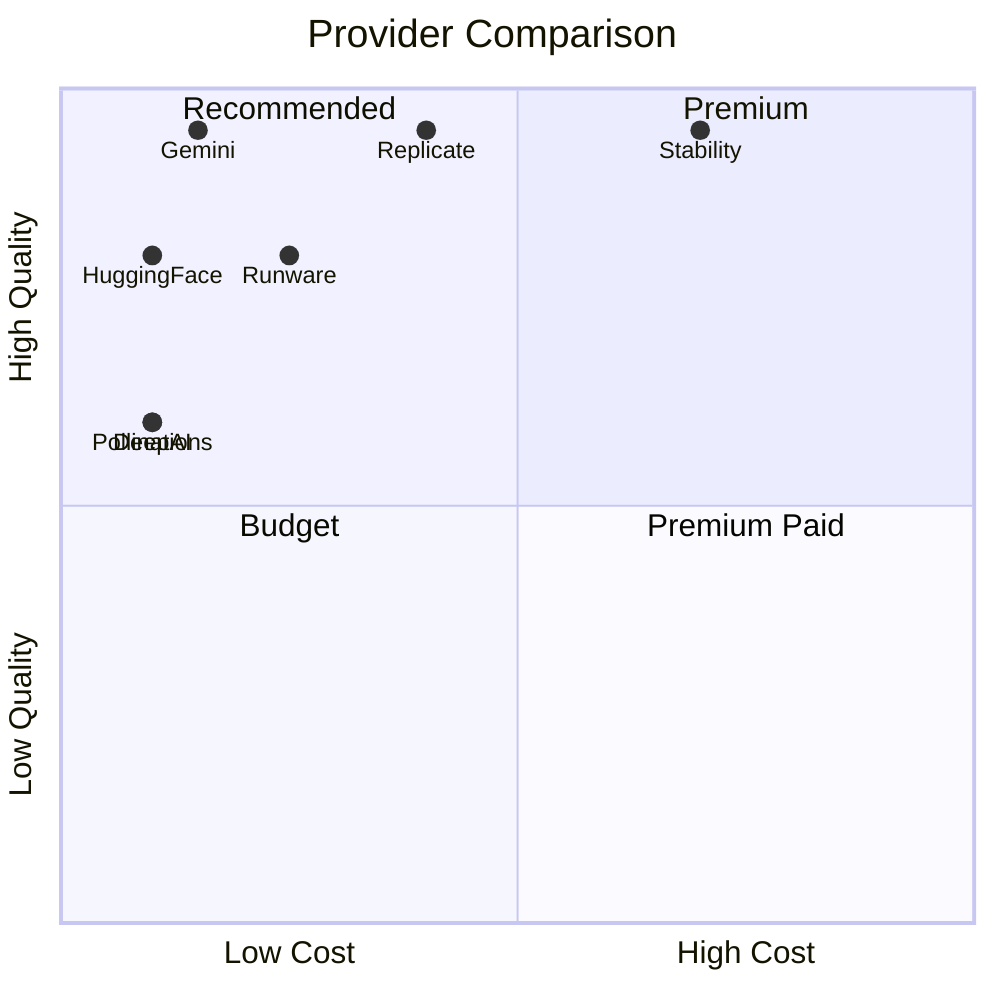

# 🎨 OpenImage Documentation

<div class="grid cards" markdown>

- :material-rocket-launch: **Quick Start**

    ---
    Get OpenImage running in 30 seconds with Docker

    [:octicons-arrow-right-24: Installation Guide](install.md)

- :material-api: **API Providers**

    ---
    Configure 8 AI image generation providers

    [:octicons-arrow-right-24: Provider Setup](apis.md)

- :material-cog: **Advanced Features**

    ---
    Upscaling, style presets, and batch operations

    [:octicons-arrow-right-24: Features Guide](features.md)

- :material-magnify: **Search & Tags**

    ---
    Organize and find your generated images

    [:octicons-arrow-right-24: Search Guide](search.md)

</div>

---

## Welcome to OpenImage

OpenImage is a professional **Django-based AI image generation platform** that provides unified access to multiple image generation providers through a single, elegant interface.

### 🎯 Key Features

=== "Generation"
    - **8 AI Providers**: Free and paid options
    - **Multiple Models**: FLUX.1, Stable Diffusion, Gemini
    - **Style Presets**: 10+ artistic styles
    - **Custom Parameters**: Full control over generation

=== "Enhancement"
    - **AI Upscaling**: Real-ESRGAN integration
    - **Format Conversion**: PNG, JPEG, WEBP
    - **Batch Processing**: Multiple images at once
    - **Quality Control**: CFG scale, seed management

=== "Organization"
    - **Smart Search**: Prompt and tag-based
    - **Category System**: Auto-tagging
    - **History Tracking**: Full metadata
    - **Export Options**: Bulk download

=== "Deployment"
    - **Docker Ready**: Complete containerization
    - **PostgreSQL**: Production database
    - **pgAdmin**: Database management
    - **Documentation**: Full MkDocs site

---

## 📊 Architecture Overview



### Service Architecture

| Component | Technology | Purpose |
|-----------|------------|---------|
| **Web App** | Django 5.2.6, Python 3.11 | Main application |
| **Database** | PostgreSQL 14 | Data persistence |
| **Admin** | pgAdmin 4 | Database management |
| **Docs** | MkDocs Material | Documentation site |
| **Upscaler** | Real-ESRGAN | AI image enhancement |

---

## 🚀 Quick Start

### With Docker (Recommended)

```bash
git clone https://github.com/yourusername/openimage.git
cd openimage/oi_v2
chmod +x start.sh
./start.sh
```

Access at: **http://localhost:9510**

### Without Docker

```bash
python3.11 -m venv venv
source venv/bin/activate
pip install -r requirements.txt
python manage.py migrate
python manage.py runserver
```

---

## 📚 Documentation Sections

### For Users

<div class="grid" markdown>

=== "Getting Started"
    - [Installation Guide](install.md) - Setup OpenImage
    - [Configuration](config.md) - Environment variables & API keys
    - [First Generation](tutorial.md) - Create your first image

=== "Features"
    - [AI Providers](apis.md) - Available image generation APIs
    - [Style Presets](styles.md) - Artistic style options
    - [Upscaling](upscaling.md) - Enhance image resolution
    - [Search & Tags](search.md) - Organize your images

=== "Advanced"
    - [Batch Operations](batch.md) - Process multiple images
    - [API Usage](api.md) - Programmatic access
    - [Custom Models](custom-models.md) - Add new providers
    - [Deployment](deployment.md) - Production setup

</div>

### For Developers

<div class="grid" markdown>

=== "Development"
    - [Dev Guide](dev.md) - Development workflow
    - [Architecture](architecture.md) - System design
    - [Database Schema](database.md) - Data models
    - [Testing](testing.md) - Test suite

=== "API Reference"
    - [REST Endpoints](api-reference.md) - HTTP API
    - [Python Clients](python-api.md) - AI client classes
    - [Models](models-reference.md) - Django models
    - [Views](views-reference.md) - View functions

=== "Contributing"
    - [Contributing Guide](contributing.md) - How to contribute
    - [Code Style](code-style.md) - Coding standards
    - [Pull Requests](pull-requests.md) - PR guidelines
    - [Roadmap](roadmap.md) - Future plans

</div>

---

## 🎨 Supported AI Providers

### Free Providers (No Payment Required)

| Provider | Quality | Speed | Daily Limit | API Key |
|----------|---------|-------|-------------|---------|
| **Pollinations.ai** | ⭐⭐⭐ | ⚡⚡⚡ | Unlimited | Not required |
| **Google Gemini** | ⭐⭐⭐⭐⭐ | ⚡⚡ | 1500 images | Required |
| **Hugging Face** | ⭐⭐⭐⭐ | ⚡ | Generous | Optional |

### Paid Providers (Budget-Friendly)

| Provider | Cost/Image | Quality | Best For |
|----------|------------|---------|----------|
| **Runware** | $0.002 | ⭐⭐⭐⭐ | High volume production |
| **Replicate** | $0.003-0.005 | ⭐⭐⭐⭐⭐ | Top quality results |
| **Stability AI** | $0.01-0.04 | ⭐⭐⭐⭐⭐ | Enterprise applications |
| **DeepAI** | $0.01 | ⭐⭐⭐ | Simple creative tasks, prototyping |

[Learn more about providers →](apis.md)

---

## 💡 Use Cases

### E-Commerce Product Images

```yaml
Provider: Google Gemini or Runware
Prompt: "Professional product photo, white background, studio lighting, high detail"
Style: Realistic Photo
Resolution: 1024x1024
Post-process: Upscale to 2048x2048
```

### Social Media Content

```yaml
Provider: Pollinations (fast & free)
Prompt: "Vibrant [subject], eye-catching, trending on Instagram"
Style: Varies by niche
Resolution: 1024x1024 (1:1) or 1024x1820 (9:16)
```

### Blog Illustrations

```yaml
Provider: Hugging Face (FLUX.1 Schnell)
Prompt: "Illustration for [topic], professional, clear, engaging"
Style: Minimalist or Fantasy Art
Resolution: 1820x1024 (16:9)
```

### Game Assets

```yaml
Provider: Replicate (FLUX.1)
Prompt: "Game asset, [description], isometric view, clean edges"
Style: Comic Book or Fantasy Art
Post-process: Batch generate variations
```

---

## 🔧 System Requirements

### Minimum Requirements

- **CPU**: 2 cores
- **RAM**: 2GB (4GB recommended)
- **Storage**: 5GB free space
- **OS**: Linux, macOS, Windows (with Docker)
- **Network**: Stable internet connection

### Docker Requirements

- **Docker**: 20.10+
- **Docker Compose**: 2.0+

### Manual Install Requirements

- **Python**: 3.11+
- **PostgreSQL**: 14+ (optional, SQLite works too)
- **pip**: Latest version

---

## 📈 Performance Metrics

### Generation Speed Comparison

```mermaid
gantt
    title Average Generation Time (seconds)
    dateFormat X
    axisFormat %s
    
    section Free
    Pollinations     :0, 3s
    Gemini          :0, 8s
    Hugging Face    :0, 15s
    DeepAI          :0, 5s
    
    section Paid
    Runware         :0, 6s
    Replicate       :0, 25s
    Stability AI    :0, 7s
    DeepAI          :0, 5s
```



### Quality vs Speed vs Cost



---

## 🛡️ Security & Privacy

### Data Handling

- ✅ Images stored locally or in your database
- ✅ No third-party tracking
- ✅ API keys stored securely in environment variables
- ✅ HTTPS support for production
- ✅ CSRF protection enabled
- ✅ SQL injection prevention (Django ORM)

### API Key Security

!!! warning "Important"
    Never commit `.env` file to version control. Use `.env.example` as template.

```bash
# Good practice
echo ".env" >> .gitignore
cp .env.example .env
# Edit .env with your keys
```

### Provider Privacy Policies

| Provider | Data Retention | Commercial Use | Training Data |
|----------|---------------|----------------|---------------|
| Pollinations | Unknown | ✅ Allowed | May use |
| Gemini | Per Google policy | ✅ Allowed | May use |
| Hugging Face | Per model | ✅ Varies | Varies |
| Others | Check ToS | ✅ Usually allowed | Varies |

[Security best practices →](security.md)

---

## 🐛 Common Issues

### Quick Fixes

=== "API Key Errors"
    ```bash
    # Verify .env file
    cat .env | grep API_KEY
    
    # Restart Django
    docker-compose restart site
    ```

=== "Generation Timeouts"
    ```python
    # Increase timeout in settings.py
    GENERATION_TIMEOUT = 120  # seconds
    ```

=== "Database Errors"
    ```bash
    # Reset migrations
    docker-compose exec site python manage.py migrate --fake
    docker-compose exec site python manage.py migrate
    ```

=== "Port Conflicts"
    ```yaml
    # Change ports in docker-compose.yml
    ports:
      - "9510:8001"  # Change 9510 to available port
    ```

[Full troubleshooting guide →](troubleshooting.md)

---

## 📞 Getting Help

### Documentation

- 📖 [Installation Issues](install.md#troubleshooting)
- 🔧 [Configuration Problems](config.md#common-errors)
- 🎨 [Generation Tips](tutorial.md#best-practices)
- 🚀 [Deployment Guide](deployment.md)

### Community

- 💬 [GitHub Discussions](https://github.com/yourusername/openimage/discussions)
- 🐛 [Issue Tracker](https://github.com/yourusername/openimage/issues)
- 📧 [Email Support](mailto:support@openimage.dev)

### Resources

- 📚 [API Documentation](api-reference.md)
- 🎓 [Video Tutorials](tutorials.md)
- 📝 [Blog Posts](blog.md)
- 🔗 [External Links](resources.md)

---

## 🎉 What's New

### Version 0.3.0 (Current)

??? success "New Features"
    - ✨ Real-ESRGAN AI upscaling (2x, 4x)
    - 🎨 10 style presets (Realistic, Anime, Oil Painting, etc.)
    - 🏷️ Tag-based search and categorization
    - 📦 Batch operations support
    - 🔍 Advanced search with filters
    - 📊 Enhanced metadata tracking
    - 💾 DeepAI provider integration

??? info "Improvements"
    - ⚡ Faster image loading in gallery
    - 🎯 Better error messages
    - 📱 Improved mobile responsiveness
    - 🔒 Enhanced security measures
    - 📝 Comprehensive documentation

??? bug "Bug Fixes"
    - Fixed Hugging Face cold start issues
    - Resolved CSS loading problems
    - Corrected timezone handling
    - Fixed PostgreSQL connection pooling

[Full changelog →](changelog.md)

---

## 🗺️ Roadmap

### Upcoming Features

- [ ] User authentication & multi-user support
- [ ] Image-to-image editing capabilities
- [ ] ControlNet integration
- [ ] LoRA model support
- [ ] Public gallery & sharing
- [ ] REST API with authentication
- [ ] Webhook notifications
- [ ] Mobile app (React Native)

[See full roadmap →](roadmap.md)

---

## 📜 License

OpenImage is released under the **MIT License**.

```
Copyright (c) 2025 OpenImage Contributors

Permission is hereby granted, free of charge, to any person obtaining a copy
of this software and associated documentation files...
```

[Read full license →](https://opensource.org/licenses/MIT)

---

<div align="center">

**Built with ❤️ using Django, PostgreSQL, and cutting-edge AI**

[⭐ Star on GitHub](https://github.com/yourusername/openimage) •
[📖 Read the Docs](https://openimage.readthedocs.io) •
[🐛 Report Bug](https://github.com/yourusername/openimage/issues)

</div>